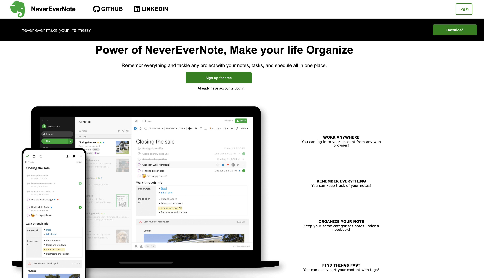
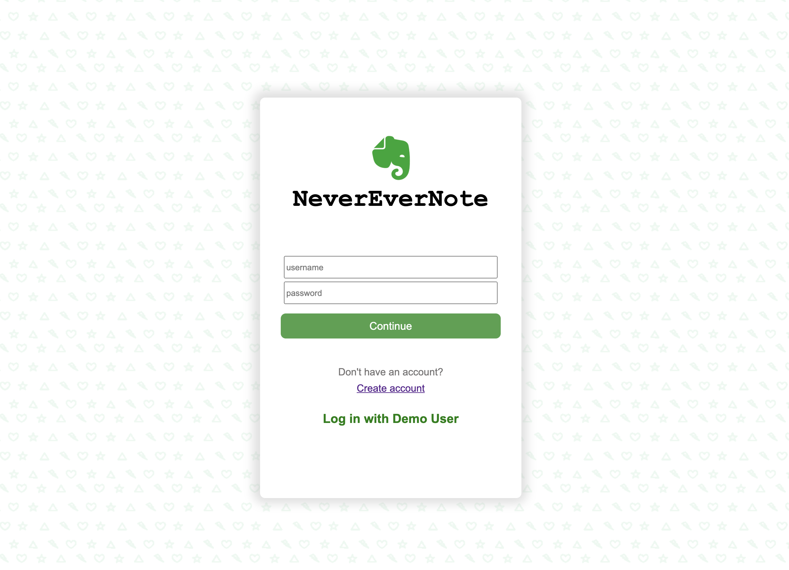
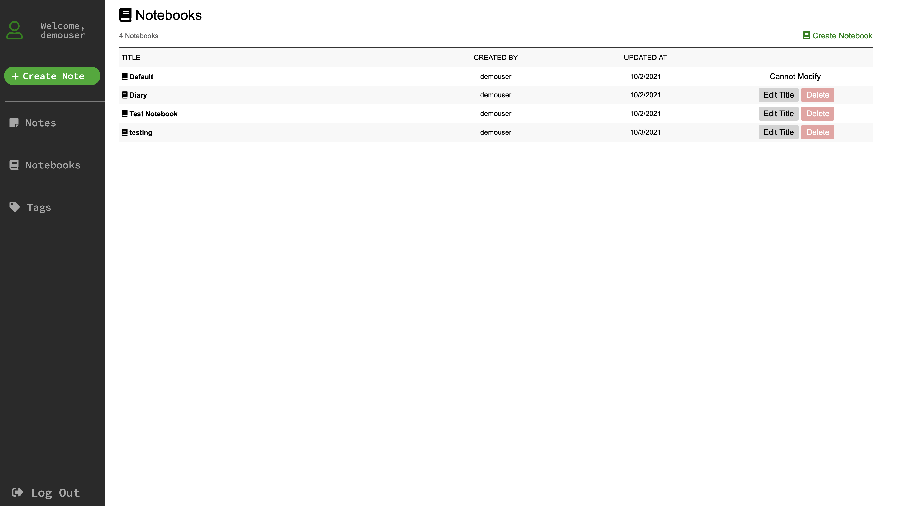

# NeverEverNote

NeverEverNote is a clone of Evernote, a note taking web app. NeverEverNote allows you to organize your notes into collection called notebooks.

[NeverEverNote](https://neverevernote.herokuapp.com)

#### Homepage


#### Login Page


#### Notes Page


#### Notebooks Page


<br/>

## Deployment
1. First, `bundle install` followed by `npm install`
2. Initialize the database with `rails db:reset`. You must be running PostgresSQL (sudo service postgresql start).
3. Start the server with `rails s`
4. Compile the javascript with `npm start`
5. Navigate your browser to `localhost:3000`


## Technologies Used
NeverEverNote is built with `PostgresSQL`, `Rails`, `React`, and `Redux`.

PostgresSQL is used to store the users, notes, and notebooks in a database.

Rails is used to create an API interface for the back end. Rails perform SQL queries and outputs data from the database in the form of JSON objects.

React is used to create a front-end for the information output by the API. Thunk actions perform API calls and then send the response to a Reducer which populates the Redux store. Then the React components use information from the store, such as the current user or some subset of notes, to present information.


## Features
#### Notes
Notes are a table in the database with columns for title, body, user_id, and notebook_id.

Users are able to create, view, update, and delete `notes`.

Users can see their notes only after logging in. All notes list can be viewed automatically after logging in.

Rich text editor library, `React-Quill` was used for editing body of notes. It was one of challenging aspect. 

Notes are view based on the updated time.


```Javascript
class NotesIndexList extends React.Component {
    constructor(props) {
        super(props);
    }

    render() {
        let notes = this.props.notes.sort()
        const date = notes.map((note, i )=> [note.updated_at, i]);
        date.sort().reverse();
        let sort_notes = [];

        if (date){
            for(let i = 0; i < date.length; i++){
                let temp = date[i][1];
                let temp_note = notes[temp];
                sort_notes.push(temp_note);
            }
        }

        if(sort_notes){
            notes = sort_notes;
        }

        return(
            <ul>
                {notes.map((note) => <NoteIndexItem note={note} key={note.id} url={this.props.url} />)}
            </ul>
        )
        )
    }

```


#### Notebooks
Notebooks are a table in the database with columns for title, user_id.

Users are able to create, view, update, and delete `notebooks`.

Users can see their notebooks after logging in by clicking Notebooks on the left sidebar. This will display lists of the notebooks, where users can rename the title of the notebooks. By clicking notebook title, they can go to the notes list, which notes that are under certain notebooks. 

```Javascript
const mSTP = state => ({
    currentUser: state.entities.users[state.session.id],
    notebooks: Object.values(state.entities.notebooks),
    errors: state.errors.notebooks
})

const mDTP = dispatch => ({
    fetchNotebooks: () => dispatch(fetchNotebooks()),
    createNotebook: notebook => dispatch(createNotebook(notebook)),
    updateNotebook: notebook => dispatch(updateNotebook(notebook)),
    deleteNotebook: notebookId => dispatch(deleteNotebook(notebookId))
})

export default connect(mSTP, mDTP)(NotebooksIndex);
```


## Future Features
- Tags
- Moving Notes (from current notebook to other notebook)